# Bread State Machine Diagrams

This document maps out all component state transitions to verify correctness at a systems level.

## 1. Trading Simulator State Machine


## 2. Live Price Update State Machine


## 3. Polymarket Integration State Machine


## 4. Monte Carlo Simulation State Machine


## 5. News Widget State Machine


## 6. Weather Widget State Machine

```mermaid
stateDiagram-v2
    [*] --> GeoRequest: Component mount

    GeoRequest --> GetCoords: navigator.geolocation
    GetCoords --> FetchWeather: Coords received
    GetCoords --> Default: Denied/unavailable

    Default --> FetchWeather: Use default coords

    FetchWeather --> ParseData: API success
    FetchWeather --> Error: API failure

    ParseData --> Display: Show temp, condition
    Display --> [*]

    Error --> [*]: Show fallback UI
```

## 7. Global App State Flow

```mermaid
stateDiagram-v2
    [*] --> Mount: App loads

    Mount --> InitTheme: Check localStorage dark mode
    Mount --> InitData: Fetch live prices
    Mount --> InitPolymarket: Fetch markets

    InitTheme --> Ready
    InitData --> Ready
    InitPolymarket --> Ready

    Ready --> SimulatorTab: User clicks simulator
    Ready --> MarketsTab: User clicks markets
    Ready --> MonteCarloTab: User clicks analysis

    SimulatorTab --> Running: START pressed
    Running --> SimulatorTab: STOP/RESET pressed

    MarketsTab --> MarketDetail: User hovers market
    MarketDetail --> MarketsTab: Mouse leaves

    MonteCarloTab --> SimRunning: RUN pressed
    SimRunning --> MonteCarloTab: Complete

    note right of Ready
        Keyboard shortcuts:
        - S: Start/Stop simulator
        - R: Reset simulator
        - P: Toggle performance mode
        - T: Toggle $1T target
    end note
```



## Component Dependencies

```
App.jsx
├── useLivePrices()          → Delta-Threshold updates
├── usePolymarket()          → Market data
├── useStocks()              → Historical data
├── useStockHistory()        → Chart data
├── NewsWidget               → Real-time news
├── WeatherWidget            → Location-based weather
└── Trading Simulator        → Autonomous trading bot

Utils:
├── runMonteCarlo()          → Simulation engine
├── formatPrice()            → Display formatting
├── calcFibTargets()         → Position sizing
└── getTheme()               → Dark/light mode
```

---

## State Invariants

### Trading Simulator
- **Invariant 1**: `balance > 0.5 AND balance < target` while running
- **Invariant 2**: Only ONE position open at a time
- **Invariant 3**: `size <= balance × sizePercent`
- **Invariant 4**: `stop < entry < target`

### Live Prices
- **Invariant 1**: `lastUpdated <= now()`
- **Invariant 2**: `|ΔP| > 0.005 → UI update`
- **Invariant 3**: Max 1 API call per asset per 60s

### Polymarket
- **Invariant 1**: `0 <= probability <= 1`
- **Invariant 2**: Filtered markets ⊆ All markets
- **Invariant 3**: `highProb → (P >= 0.90 OR P <= 0.10)`

---

**Last Updated**: 2026-01-10
